# Splunk-windows-authentication-lab
## Overview

This project demonstrates the use of Splunk Enterprise to monitor and analyze Windows authentication activity.

## Architecture
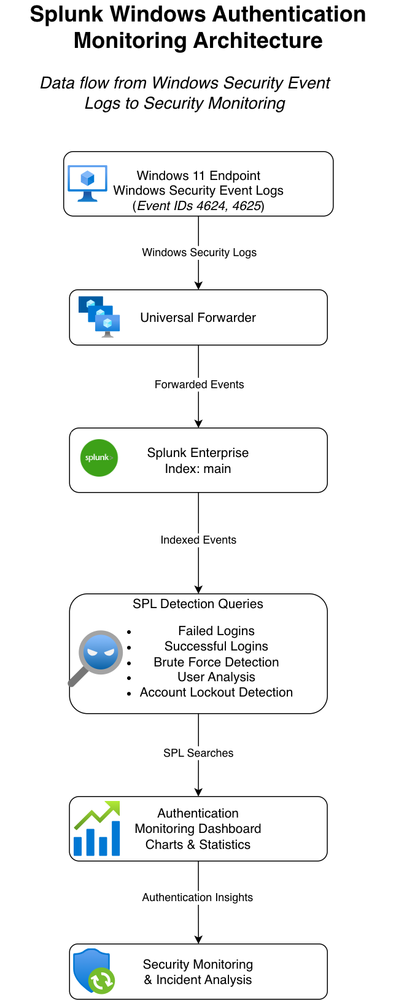

## Objectives

- Detect failed login attempts
- Detect brute-force attacks
- Monitor successful logins
- Monitor account lockouts
- Create dashboards and alerts
- Document findings

## Tools

- Splunk Enterprise
- Windows Event Logs
- SPL (Search Processing Language)

## Project Structure

```text
screenshots/
searches/
documentation/
sample-data/
```

## Detection Use Cases

1. Failed Login Detection
2. Successful Login Monitoring
3. Brute Force Detection
4. Account Lockout Detection
5. Authentication Dashboard

## Screenshots

### Main Dashboard
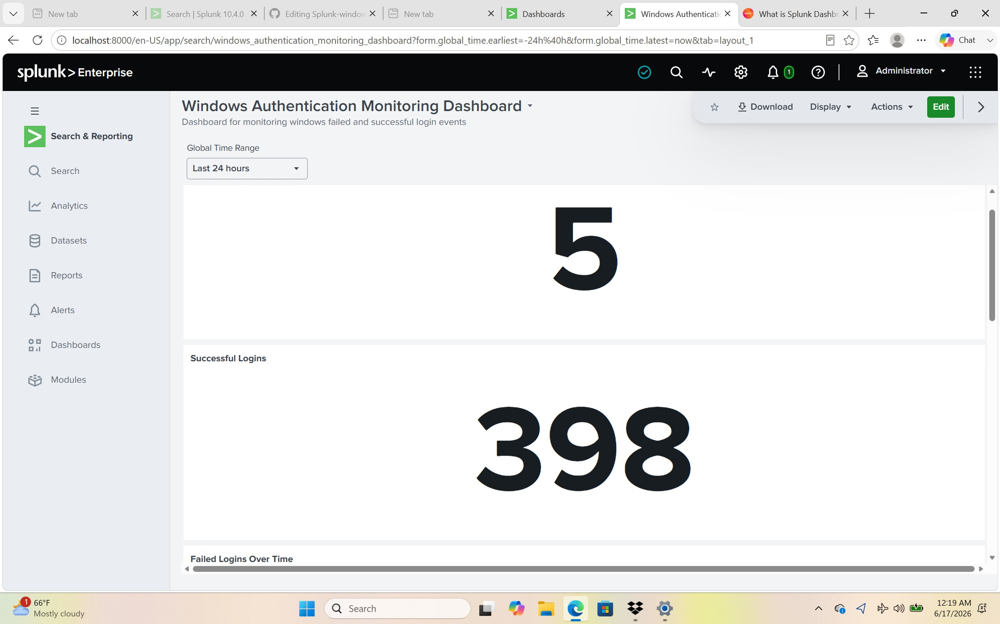


### Main Dashboard (Part 2)
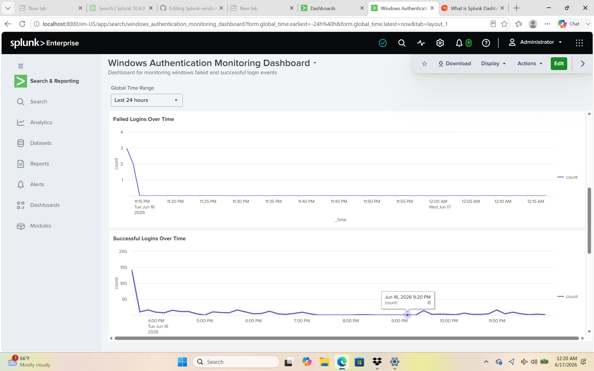


### Main Dashboard (Part 3)
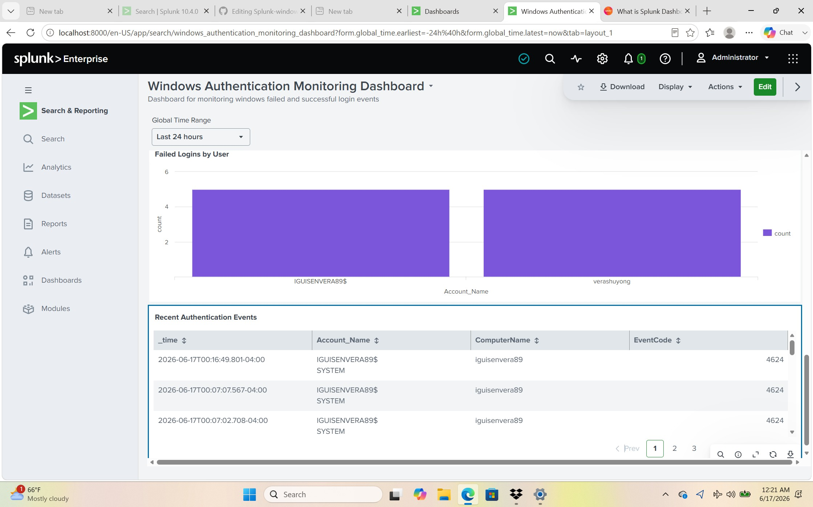


### Failed Login Events Search
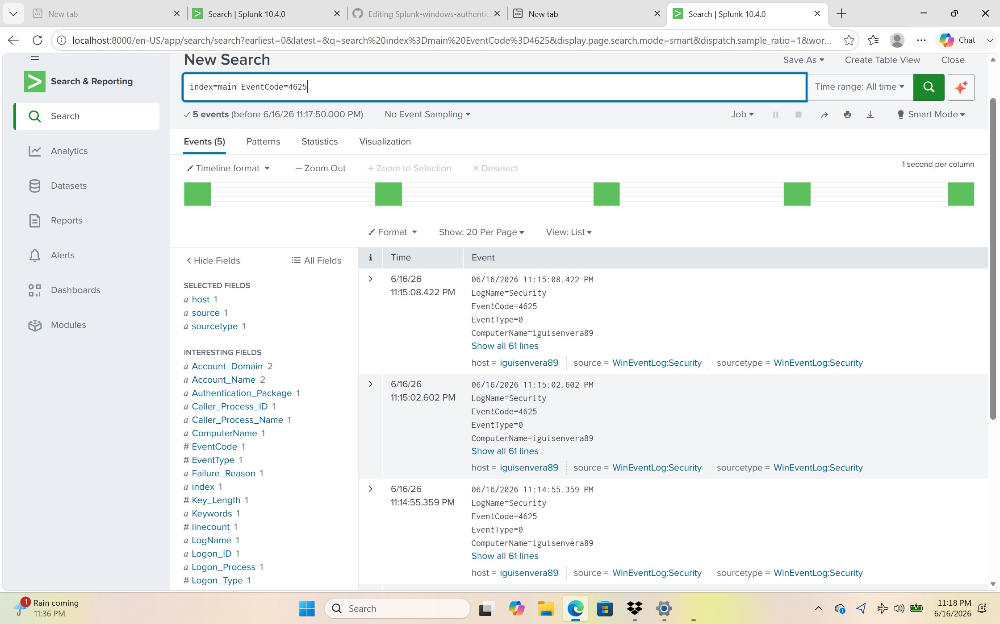


### Failed Logins by User
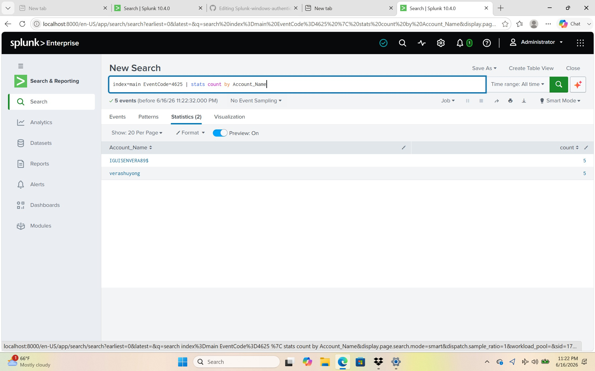


### Failed Logins by Workstation
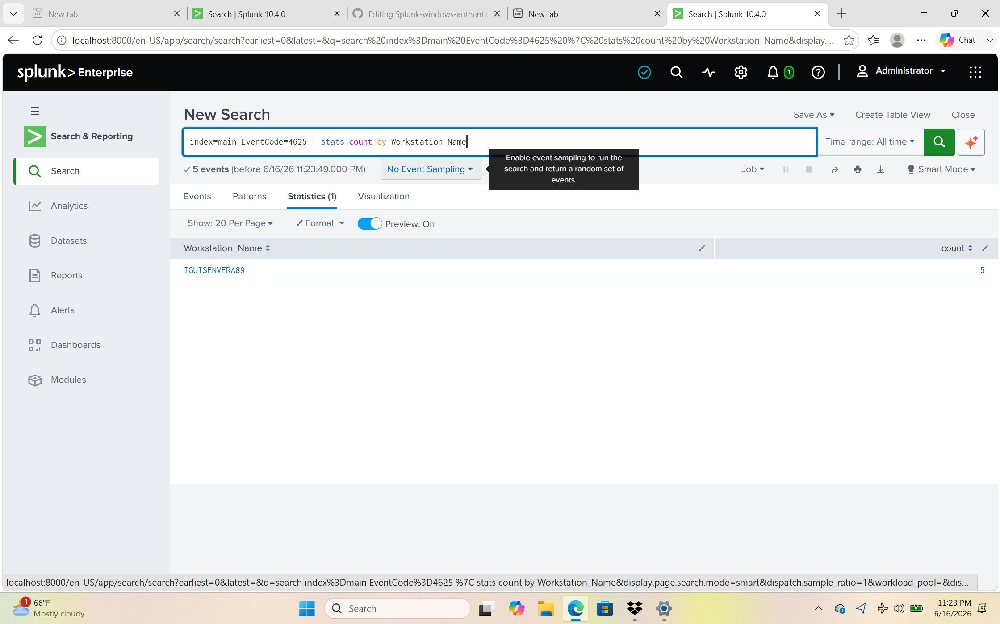


### Successful Login Events Search
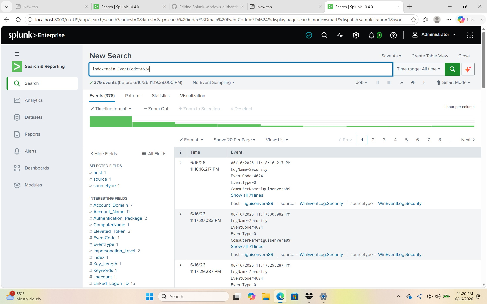


### Successful Logins by User
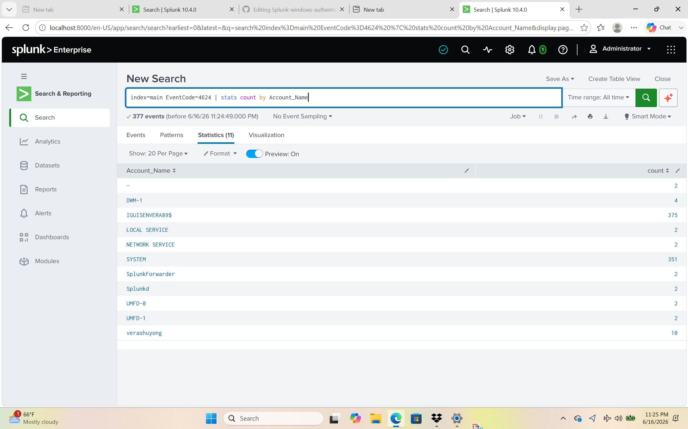


### Successful Logins Over Time
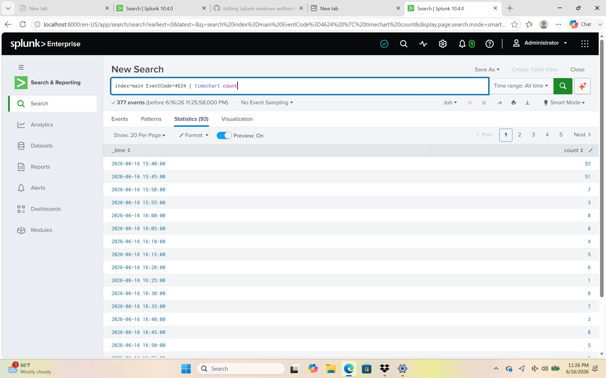


### Main Index Search
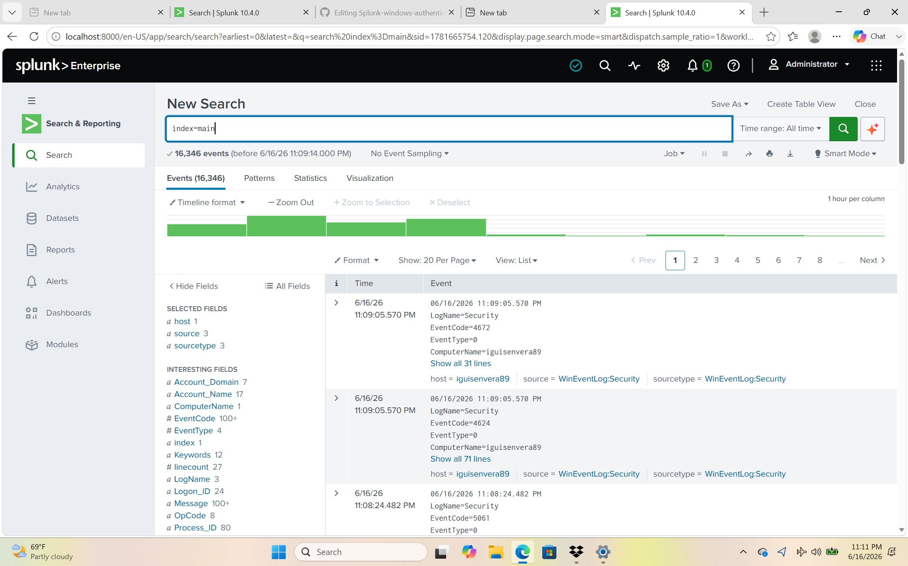


## Skills Demonstrated

- Splunk Enterprise Administration
- Windows Event Log Analysis
- SPL Query Development
- Dashboard Creation
- Authentication Monitoring
- Brute-force Detection
- Security Event Investigation


## Future Improvements

- Create alerts for repeated failed login attempts.
- Add account lockout monitoring using Event ID 4740.
- Add more Windows Security Event IDs.
- Build additional authentication dashboards.
